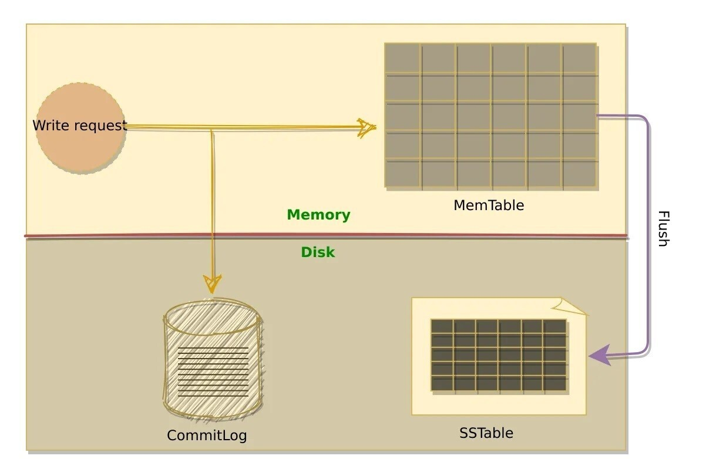
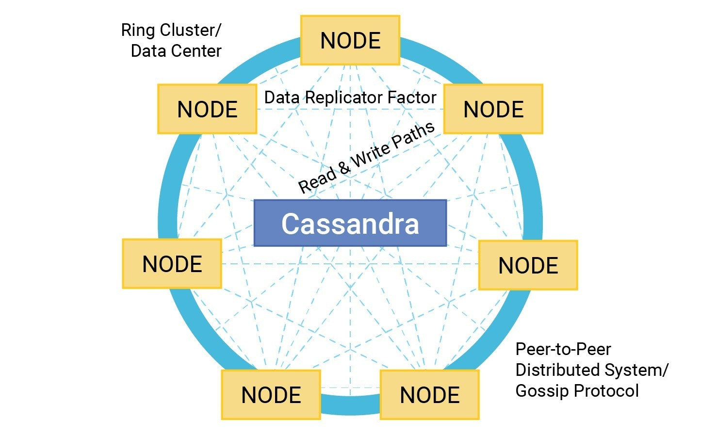
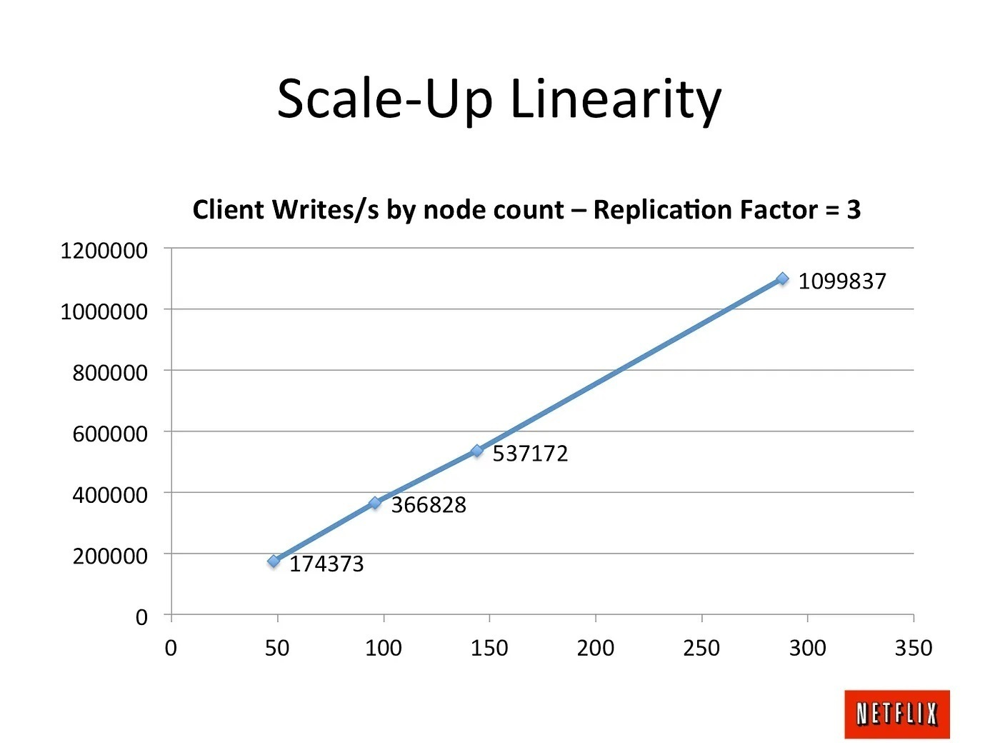

# Introduction

The exponential growth of data, often referred to as Big Data, presents significant challenges for traditional relational database systems (RDBMS). These systems struggle to manage the high volume, speed, and variety of data generated by modern applications. Apache Cassandra is a massively scalable and distributed NoSQL database designed to address these limitations. Cassandra, rooted in the technology of big data giants like Google, Amazon, and Facebook, was open-sourced by Facebook to the Apache Foundation in 2009. It has since become a cornerstone for modern businesses managing critical data infrastructure. Known for its high performance and continuous uptime, Cassandra handles massive scale efficiently, making it essential for big data applications across various industries.

As a free and open-source, distributed, wide-column store NoSQL database management system, Cassandra is designed to manage large amounts of data across many commodity servers. It ensures high availability with no single point of failure, supports clusters spanning multiple data centers, and allows low-latency operations through asynchronous masterless replication. Cassandra excels in handling structured, semi-structured, and unstructured data, offering high availability, fault tolerance, and linear scalability.

This report explores the data model, features, advantages, limitations, and operational capabilities of Cassandra, along with a demonstration of basic CRUD operations.

## Background and Development

Cassandra was originally developed at Facebook by Avinash Lakshman, one of the authors of Amazon's Dynamo, and Prashant Malik to power the Facebook inbox search feature, which needed to handle high write throughput and provide efficient search capabilities across geographically distributed data centers. Launched in June 2008 for around 100 million users, Cassandra now serves as the backend storage system for multiple services within Facebook. Facebook released Cassandra as an open-source project on Google Code in July 2008. In March 2009, it became an Apache Incubator project, and on February 17, 2010, it graduated to a top-level project. Facebook developers named their database after the Trojan mythological prophet Cassandra, with classical allusions to a curse on an oracle.

# Data Model and Features

Apache Cassandra employs a wide-column store data model, which allows for flexible schema definitions, significantly different from the row-based approach of relational databases. In Cassandra, data is stored in column families, similar to tables in relational databases but more flexible. Each row in a column family can have a different number of columns, making it suitable for handling sparse datasets.

{ width=240px }

The primary components of Cassandra’s data model include:

- **Keyspaces**: At the highest level, keyspaces are data containers in Cassandra, similar to schemas in relational databases. A keyspace typically contains multiple tables.
- **Table**: Also known as column families in earlier versions, tables are defined within keyspaces. Tables store data as rows, each identified by a unique primary key, and contain a set of columns.
- **Columns**: These define the data structure within a table, with various types such as Boolean, double, integer, and text.

## Key Features

1. **Decentralized Architecture**: Cassandra uses a peer-to-peer protocol to communicate
   across nodes, ensuring no master node exists, and every node in the cluster is equal.
2. **High Availability**: Its decentralized architecture ensures high availability and
   resilience, with data automatically replicated across multiple nodes. Cassandra can handle
   node failures gracefully with no single point of failure.
3. **Linear Scalability**: Cassandra is designed for linear scalability, meaning that
   performance increases linearly as new nodes are added to the cluster. This feature allows
   the system to handle growing amounts of data and traffic without compromising performance.
4. **Tunable Consistency**: Users can configure consistency levels per operation, balancing
   strong consistency and eventual consistency based on their requirements.

# Justification for Development

Apache Cassandra was developed to address the limitations of relational databases in handling big data workloads. Traditional RDBMSs struggle with scalability, flexibility, and performance when faced with large volumes of unstructured data. Cassandra offers several advantages that make it a superior choice for big data applications:

## Advantages Over Traditional RDBMSs

1. Efficient Handling of Large Volumes of Unstructured Data

   - Cassandra's column-based data model allows for efficient storage and retrieval of unstructured data, which is often encountered in big data applications.

2. Extremely High Write Throughput

   - Cassandra is optimized for high write throughput, making it suitable for applications that require frequent and rapid data ingestion.

3. Flexible Schema

   - Cassandra's schema-less design allows for easy modifications and additions to the data model, accommodating evolving application requirements without downtime.

## Limitations

While Cassandra provides significant benefits, it also has some limitations:

1.  Lack of ACID Transactions

    - Cassandra does not support traditional ACID (Atomicity, Consistency, Isolation, Durability) transactions, which can be essential for applications that require strict data consistency, such as financial systems.

2.  Limited Support for Complex Queries

    - Cassandra's query capabilities, while powerful for many use cases, are not as advanced as SQL databases when it comes to complex joins and aggregations.

## Application Areas

Despite these limitations, Cassandra excels in various application areas, including:

1. Real-time Big Data Applications

   - Cassandra excels in environments where real-time data processing is crucial, such as fraud detection systems and recommendation engines. Its low-latency data access and high throughput ensure timely and accurate responses, critical for these applications.

2. Time Series Data Management

   - Cassandra's efficient handling of time-series data makes it a preferred choice for applications such as monitoring, logging, and IoT data management. The ability to store and query time-series data efficiently is essential for these use cases.

3. Internet of Things (IoT)

   - Its ability to handle high write throughput and large volumes of time-series data makes Cassandra ideal for IoT applications. It can manage the constant influx of data from various sensors and devices, ensuring seamless data ingestion and analysis.

4. Social Media Platforms

   - Platforms like Instagram and Facebook use Cassandra to manage large volumes of user data and interactions efficiently. Cassandra's scalability and high availability are crucial for maintaining performance and user experience on these platforms.

5. Online Web Retail and High-velocity E-commerce Systems

   - Cassandra's high availability and fault tolerance ensure that e-commerce platforms can provide continuous service and handle large volumes of transactions smoothly. The flexible schema allows for quick adaptation to new business requirements and data models.

6. Social Media Input and Analysis

   - The need to store and analyze vast amounts of social media data in real-time aligns well with Cassandra's strengths in scalability and write performance. This is essential for providing personalized user experiences and real-time insights.

# Storage Architecture

Cassandra's storage architecture is designed to ensure high performance, scalability, and fault tolerance. It consists of several key components:

## Ring Topology

Nodes in a Cassandra cluster are arranged in a ring. This ensures even distribution of data across the cluster. Each node in the ring is responsible for a portion of the data, which is determined by a hash function.

## Partitioner

The partitioner distributes data across nodes using consistent hashing. This ensures an even distribution and efficient retrieval of data. Each piece of data is assigned a token, and the partitioner maps these tokens to nodes.

{ width=500px }

## Replication

Cassandra provides high availability and fault tolerance through data replication. Data is replicated across multiple nodes. The replication factor determines the number of replicas for each piece of data, ensuring that it remains accessible even if some nodes fail.

{ width=400px }

## SSTables (Sorted String Tables)

SSTables are immutable, on-disk data structures. Data from the Memtable is periodically flushed to SSTables, ensuring long-term storage. SSTables are written sequentially and never modified, which makes write operations efficient and read operations fast.

## Log-Structured Merge-Tree (LSM Tree)

Cassandra uses a log-structured merge-tree (LSM tree) to optimize write operations. Data is first written to the Memtable and then periodically flushed to disk as SSTables. This structure helps maintain high write performance and ensures data durability. Each partition is a collection of rows, and each row contains columns identified by a unique key. This allows Cassandra to handle large volumes of data while maintaining scalability and performance.

## Commit Log

The commit log is an append-only log that records all write operations. This ensures the durability of write operations by recording changes before they are applied. If a node fails, the commit log can be used to recover any data not yet written to SSTables.

{ width=400px }

## Memtable

The Memtable is an in-memory data structure that stores recent writes. When data is written to Cassandra, it is first stored in the Memtable for quick access. Periodically, the Memtable is flushed to disk to create SSTables.

{ width=400px }

## Compaction

Compaction merges SSTables, consolidates data, removes deleted data (tombstones), and optimizes read performance. It reduces the number of SSTables that need to be checked during read operations, improving efficiency.

{ width=300px }

## Caching

Cassandra supports various caching mechanisms to enhance read performance. The key cache stores the locations of data on disk, while the row cache stores entire rows. These caches help reduce disk I/O and improve read speeds.

## Hinted Handoff and Repair

Hinted handoff and repair mechanisms maintain data consistency and availability. When a node is down, hinted handoff temporarily stores data intended for the downed node on a live node. Once the downed node is back online, the stored data is sent to it. Repair processes ensure that all replicas of data remain consistent over time.

{ width=400px }

## Bloom Filters and Indexes

Cassandra uses Bloom filters to quickly check the existence of rows in SSTables. These probabilistic data structures help avoid unnecessary disk I/O by indicating whether a row might exist in an SSTable. Additionally, Cassandra maintains indexes to speed up data retrieval.

## Tombstones

When data is deleted, a tombstone marker is placed on it rather than immediately removing it. This marker indicates that the data is deleted and will be removed during the next compaction process. Tombstones ensure deletions are propagated to all replicas.

## Summary

{ width=300px }

Cassandra's storage architecture ensures high performance, scalability, and fault tolerance by distributing data evenly, replicating it for availability, and using efficient data structures for fast read and write operations.

# Scalability

Cassandra supports horizontal scalability through data partitioning and replication. Adding more nodes to the cluster seamlessly increases its capacity and ensures load balancing. This capability enables the database to handle increased loads without compromising performance. Data is replicated across multiple nodes to provide fault tolerance and high availability.

{ width=300px }

A notable example of Cassandra's scalability is Netflix's benchmark, which demonstrated the ability to handle 1.1 million writes per second across a 288-node cluster, with linear performance increases as nodes were added.

# Query Capabilities

Cassandra uses the Cassandra Query Language (CQL), which resembles SQL but is tailored for its column-based model. CQL allows users to perform CRUD operations (Create, Read, Update, Delete) and supports secondary indexes and materialized views for efficient querying. Concurrency Control Features Cassandra employs an eventual consistency model, allowing for high availability and partition tolerance. It uses tunable consistency, enabling developers to choose the level of consistency required for their applications, ranging from eventual to strong consistency. This flexibility lets users prioritize performance or consistency based on their application needs.

# Concurrency Control

Cassandra uses an eventual consistency model, often referred to as BASE (Basically Available, Soft state, Eventual consistency), in contrast to the ACID model of traditional databases. Key aspects include:

- Tunable consistency levels, allowing developers to balance between consistency and availability
- Per-operation consistency settings, enabling fine-grained control
- Support for lightweight transactions for operations requiring linearizability

While this model sacrifices some consistency guarantees, it allows Cassandra to achieve high availability and partition tolerance, crucial for distributed systems.

# Fault Tolerance

Cassandra ensures fault tolerance through data replication. Each piece of data is replicated across multiple nodes, ensuring that the system can automatically handle node failures without data loss. Features like hinted handoff and repair mechanisms help maintain data consistency and availability.

{ width=240px }

# Demo of Basic CRUD Operations

To demonstrate Cassandra's capabilities, we can perform basic CRUD (Create, Read, Update, Delete) operations:

## Create a keyspace and table:

```sql
CREATE KEYSPACE example_ks WITH replication = {'class': 'SimpleStrategy',
'replication_factor': 3};

USE example_ks;

CREATE TABLE users (id UUID PRIMARY KEY, name TEXT, email TEXT);

```

**Breakdown of the Command:**

1. _CREATE KEYSPACE example_ks:_

- CREATE KEYSPACE: Specifies creating a new keyspace.
- example_ks: Name of the keyspace.

2. - WITH replication = {'class': 'SimpleStrategy', 'replication_factor': 3}:\*

- WITH replication: Defines the replication strategy.
- {'class': 'SimpleStrategy', 'replication_factor': 3}:
  - 'class': 'SimpleStrategy': Uses the SimpleStrategy, suitable for a single data center.
  - 'replication_factor': 3: Each piece of data is stored on three different nodes.

## Insert data (Create):

```sql
INSERT INTO users (id, name, email) VALUES (uuid(),
'Mr. Boombastic a.k.a Big B', '0x@bontal.net');
```

## Query data (Read):

```sql
SELECT * FROM users WHERE id = <uuid_value>;
```

## Modify existing data (Update):

```sql
UPDATE users SET email = 'Mr305@bontal.net' WHERE id = <uuid_value>;
```

## Remove data (Delete):

```sql
DELETE FROM users WHERE id = <uuid_value>;
```

These operations showcase Cassandra's ability to handle basic data management tasks efficiently.

# Conclusion

Apache Cassandra is a robust and scalable NoSQL database, ideal for applications that demand high write throughput and the ability to handle large amounts of data across distributed systems. Its column-family data model and decentralized architecture provide flexibility and high availability, making it a suitable choice for real-time big data applications, IoT, and social media platforms.

While Cassandra offers many advantages, such as horizontal scalability and tunable consistency, it also has some limitations. The eventual consistency model may not be suitable for all applications, and its querying capabilities are less advanced than those of traditional SQL databases.

Despite these challenges, Cassandra’s strengths in handling large-scale data workloads, high write throughput, and fault tolerance make it a valuable tool in the NoSQL database landscape. As technology continues to evolve, improvements in Cassandra’s capabilities and user-friendliness are likely, further solidifying its position as a leading NoSQL database solution.

# References

Apache Cassandra Documentation. (n.d.). Apache Cassandra. Retrieved from https://cassandra.apache.org/doc/latest/

DataStax Corporation. (2013). Introduction to Apache Cassandra. Retrieved from https://www.odbms.org/wp-content/uploads/2014/06/WP-IntroToCassandra.pdf

LAKSHMAN, A., & MALIK, P. (2010). Cassandra - A Decentralized Structured Storage System. Operating Systems Review, 44(2), 35–40. https://doi.org/10.1145/1773912.1773922

Lars, G. (2011). HBase: the definitive guide : [random access to your planet-size data]. O’Reilly.

Cockcroft, A., & Sheahan, D. (2011, November 2). Benchmarking Cassandra scalability on AWS — Over a million writes per second. Netflix Technology Blog. Retrieved from https://netflixtechblog.com/benchmarking-cassandra-scalability-on-aws-over-a-million-writes-per-second-39f45f066c9e

Hamilton, J. (2008, July 12). Facebook releases Cassandra as open source. Retrieved June 4, 2009, from http://perspectives.mvdirona.com/2008/07/12/FacebookReleasesCassandraAsOpenSource.aspx

Is this the new hotness now? (2009, March 2). Mail-archive.com. Archived from the original on April 25, 2010. Retrieved March 29, 2010, from http://www.mail-archive.com/cassandra-dev@incubator.apache.org/msg00004.html

Cassandra is an Apache top level project. (2010, February 18). Mail-archive.com. Archived from the original on March 28, 2010. Retrieved March 29, 2010, from http://www.mail-archive.com/cassandra-dev@incubator.apache.org/msg01518.html

The meaning behind the name of Apache Cassandra. (n.d.). Archived from the original on November 1, 2016. Retrieved July 19, 2016, from https://web.archive.org/web/20161101091045/http://kellabyte.com/2013/01/04/the-meaning-behind-the-name-of-apache-cassandra

Byali, Ramesh. (2022). Cassandra is a Better Option for Handling Big Data in a No-SQL Database. 880-883.

Agrawal, A. (2024, May 28). Cassandra: Introduction. Medium. https://medium.com/@apurvaagrawal_95485/cassandra-introduction-40f95d2f40dd
